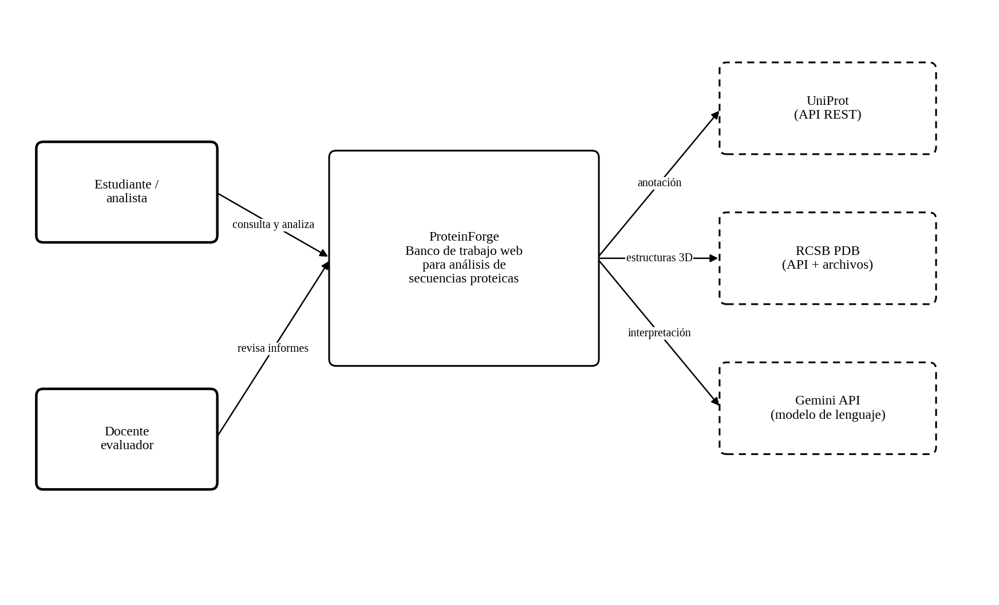
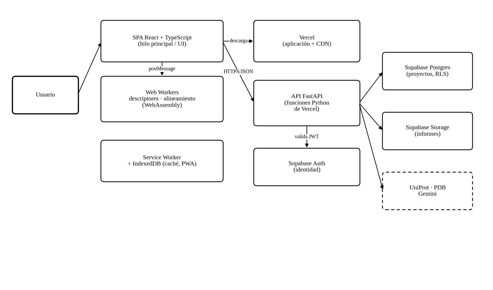
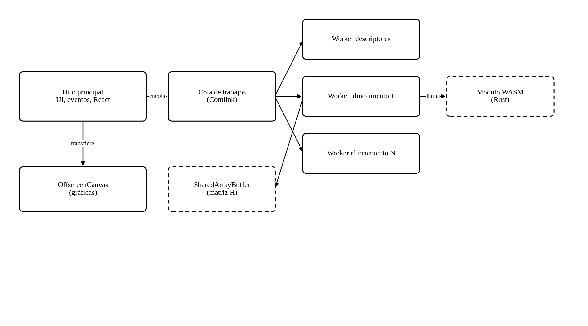

**ProteinForge: banco de trabajo web para el análisis y la visualización de secuencias y estructuras proteicas**

Jose Luis Burbano Buchelly

Programación Orientada a la Web

Documento de definición técnica del proyecto

26 de septiembre de 2026

# **Introducción**

Este documento reúne el trabajo de definición que antecede a la construcción de ProteinForge. No contiene código: su propósito es dejar establecido, antes de escribir la primera línea, qué problema se resuelve, qué hará exactamente el sistema, cómo estará organizado internamente, sobre qué tecnologías se apoyará y bajo qué criterios se considerará terminado. La experiencia acumulada en ingeniería de software indica que las decisiones tomadas en esta etapa son las más costosas de revertir una vez iniciada la implementación, porque condicionan la estructura del código y, con ella, el esfuerzo de todo cambio posterior (Richards y Ford, 2020).

El orden de las secciones sigue la secuencia habitual del diseño previo a la construcción: caracterizar el problema, fijar objetivos verificables, delimitar el alcance, identificar actores, traducir sus necesidades en requisitos, levantar sobre ellos la arquitectura y definir finalmente infraestructura, seguridad, pruebas, riesgos y planificación. Las decisiones técnicas están además orientadas a ejercitar los temas centrales de la asignatura: el modelo de ejecución de un solo hilo del navegador, el uso de *Web Workers*, la aplicación web progresiva y la nube.

# **Planteamiento del problema**

El caso de estudio original describe una dificultad de fondo: cuando se necesita encontrar un objeto que cumpla condiciones muy específicas dentro de un espacio combinatorio enorme, la estrategia de generar alternativas y evaluarlas una por una resulta impracticable. En el dominio de las proteínas, ese espacio es efectivamente descomunal: una cadena de apenas cien residuos admite veinte elevado a la centésima potencia secuencias posibles, una cifra sin equivalente físico comparable.

Ahora bien, ese problema de fondo se ataca en la práctica con modelos de gran escala que requieren infraestructura de cómputo especializada, y no es el problema que una aplicación web puede resolver ni el que esta asignatura evalúa. Lo que sí constituye una dificultad real, cotidiana y abordable desde la web es la etapa previa a cualquier trabajo serio sobre proteínas: **el análisis exploratorio y comparativo de secuencias y estructuras ya conocidas**.

Quien se inicia en bioinformática enfrenta hoy un panorama fragmentado: los descriptores se calculan en una herramienta, la anotación funcional se busca en otra, la visualización tridimensional en una tercera y el alineamiento en una cuarta, cada una con su formato de entrada y su propio ritmo de respuesta. El resultado es un flujo de copiar y pegar, propenso a errores de transcripción, difícil de reproducir y de documentar; buena parte de esas herramientas son además de escritorio o dependen de servidores institucionales con cuotas y tiempos de espera.

Existe además una dificultad técnica específica que hace interesante el problema desde la perspectiva de la programación web. Los cálculos involucrados no son triviales: el alineamiento de dos secuencias mediante programación dinámica tiene complejidad proporcional al producto de sus longitudes, de modo que comparar dos cadenas de dos mil residuos implica llenar una matriz de cuatro millones de celdas. Ejecutado ingenuamente en JavaScript sobre el hilo principal, ese cálculo congela la pestaña durante varios segundos, la interfaz deja de responder y el navegador puede llegar a ofrecer el cierre de la página. El problema, planteado en términos de la asignatura, es **cómo construir una aplicación web que ejecute cómputo científico exigente sin sacrificar la capacidad de respuesta de la interfaz**.

# **Objetivos**

## **Objetivo general**

Diseñar y construir una aplicación web progresiva que integre, en un único flujo de trabajo reproducible, la composición y edición de secuencias proteicas, el cálculo de sus descriptores fisicoquímicos, su alineamiento contra secuencias de referencia y la visualización tridimensional de estructuras experimentales asociadas, manteniendo una interfaz fluida mediante el uso de hilos de trabajo en el navegador y apoyándose en un modelo de lenguaje para la interpretación de los resultados.

## **Objetivos específicos**

- Implementar un editor de secuencias que acepte entrada manual, carga de archivos FASTA y ensamblado a partir de un catálogo de dominios y péptidos documentados en bases de datos públicas, con validación del alfabeto de aminoácidos en tiempo real.

- Calcular en el navegador, dentro de hilos de trabajo dedicados, el conjunto de descriptores fisicoquímicos de una secuencia: masa molecular, punto isoeléctrico, perfil de hidrofobicidad, índice de inestabilidad, índice alifático y propensión de estructura secundaria.

- Implementar los algoritmos de alineamiento global y local mediante programación dinámica, compilados a WebAssembly y distribuidos entre varios hilos de trabajo, de modo que el hilo principal nunca permanezca bloqueado más de cincuenta milisegundos.

- Integrar un visor tridimensional interactivo que recupere estructuras experimentales del Protein Data Bank y establezca la correspondencia visual entre la secuencia mostrada en el editor y los residuos de la estructura.

- Incorporar un asistente basado en un modelo de lenguaje que interprete los descriptores calculados, resuma la anotación funcional recuperada de UniProt y redacte un informe del análisis en lenguaje natural.

- Desplegar el sistema sobre plataformas con plan gratuito (Vercel y Supabase), manteniéndolo portable a Amazon Web Services, con integración y despliegue continuos, y verificar el cumplimiento de los requisitos no funcionales mediante una batería de pruebas automatizadas.

# **Alcance y delimitación**

Delimitar el alcance es, en un proyecto con fecha fija y una sola persona desarrollando, la decisión que más influye sobre la probabilidad de terminar. Se adopta aquí el criterio de producto mínimo viable: se construye el recorrido completo de una funcionalidad útil de punta a punta, antes que muchas funcionalidades a medias.

**Tabla 1**

*Delimitación del alcance de ProteinForge*

| **Dentro del alcance**                                                             | **Fuera del alcance**                                                        |
|------------------------------------------------------------------------------------|------------------------------------------------------------------------------|
| Editor de secuencias con validación e importación de archivos FASTA de hasta 5 MB. | Generación de secuencias nuevas mediante modelos generativos.                |
| Catálogo local de dominios y péptidos de referencia tomados de fuentes públicas.   | Predicción de plegamiento a partir de secuencia.                             |
| Descriptores fisicoquímicos calculados en el cliente.                              | Simulación de dinámica molecular o cálculo de energía libre.                 |
| Alineamiento por pares, global y local, con matrices BLOSUM.                       | Alineamiento múltiple de más de dos secuencias y construcción de filogenias. |
| Visualización 3D de estructuras experimentales descargadas del PDB.                | Edición o manipulación de coordenadas atómicas.                              |
| Consulta de anotación funcional en UniProt.                                        | Búsqueda por similitud tipo BLAST contra bases completas.                    |
| Asistente de interpretación y redacción de informes con un modelo de lenguaje.     | Cualquier afirmación de validez clínica, diagnóstica o experimental.         |
| Persistencia de proyectos por usuario autenticado y exportación a PDF y CSV.       | Trabajo colaborativo simultáneo sobre un mismo proyecto.                     |
| Funcionamiento sin conexión de los análisis locales mediante PWA.                  | Aplicaciones nativas para escritorio o dispositivos móviles.                 |

*Nota.* El sistema es una herramienta de apoyo académico y exploratorio. Los resultados que produce son de carácter orientativo y no sustituyen la verificación experimental ni el juicio de un especialista.

Las exclusiones no responden únicamente a limitaciones de tiempo. La predicción de plegamiento y la generación de secuencias requieren modelos de miles de millones de parámetros que exigen aceleradores gráficos profesionales: intentarlos desde un navegador no es cuestión de esfuerzo sino de imposibilidad material. Renunciar a ellas desde el principio permite concentrar el trabajo donde la tecnología web sí aporta una ventaja real: inmediatez, privacidad del dato local y ausencia de instalación.

# **Actores e historias de usuario**

## **Actores del sistema**

**Tabla 2**

*Actores identificados y sus objetivos*

| **Actor**          | **Descripción**                                                                                                        | **Objetivo principal**                                                                        |
|--------------------|------------------------------------------------------------------------------------------------------------------------|-----------------------------------------------------------------------------------------------|
| Analista           | Estudiante de ciencias biológicas o de la computación con formación básica en bioinformática. Es el usuario principal. | Caracterizar una secuencia y compararla con referencias conocidas sin cambiar de herramienta. |
| Docente evaluador  | Profesor que revisa el trabajo producido con la herramienta.                                                           | Acceder a informes reproducibles que muestren parámetros y resultados.                        |
| Administrador      | Responsable técnico del despliegue.                                                                                    | Supervisar disponibilidad, errores y consumo de cuotas externas.                              |
| Servicios externos | UniProt, RCSB PDB y la API de Gemini.                                                                                  | Proveer anotación, estructuras e interpretación en lenguaje natural.                          |

## **Historias de usuario principales**

Las historias se redactan en el formato habitual de las metodologías ágiles y se acompañan de sus criterios de aceptación, que son los que después se traducen directamente en pruebas automatizadas.

**Tabla 3**

*Historias de usuario y criterios de aceptación*

| **Id** | **Historia**                                                                                                                    | **Criterio de aceptación**                                                                                                          |
|--------|---------------------------------------------------------------------------------------------------------------------------------|-------------------------------------------------------------------------------------------------------------------------------------|
| HU-01  | Como analista quiero pegar o escribir una secuencia y ver de inmediato si es válida, para corregir errores antes de analizarla. | Los caracteres ajenos al alfabeto de veinte aminoácidos se resaltan en menos de 100 ms desde la última pulsación.                   |
| HU-02  | Como analista quiero cargar un archivo FASTA con varias entradas y elegir cuál analizar.                                        | Un archivo de 5 MB se analiza y lista sus entradas sin que la interfaz deje de responder.                                           |
| HU-03  | Como analista quiero ver los descriptores fisicoquímicos de la secuencia actualizados mientras la edito.                        | Los valores se recalculan dentro de un Worker y se reflejan en pantalla en menos de 300 ms para secuencias de hasta 2.000 residuos. |
| HU-04  | Como analista quiero ensamblar una secuencia combinando dominios del catálogo, para construir una variante de estudio.          | Los fragmentos se arrastran, reordenan y eliminan, y la secuencia resultante conserva la trazabilidad de su origen.                 |
| HU-05  | Como analista quiero alinear mi secuencia contra una de referencia y ver las regiones conservadas.                              | El alineamiento de dos secuencias de 2.000 residuos concluye en menos de 5 s mostrando progreso, sin bloquear la interfaz.          |
| HU-06  | Como analista quiero visualizar en tres dimensiones la estructura experimental asociada y relacionarla con la secuencia.        | Al seleccionar un tramo en el editor, los residuos correspondientes se resaltan en el visor, y viceversa.                           |
| HU-07  | Como analista quiero que el asistente me explique qué significan los descriptores obtenidos.                                    | La explicación cita los valores concretos calculados y advierte de forma visible que es una interpretación automática.              |
| HU-08  | Como analista quiero guardar mi sesión de trabajo y recuperarla después.                                                        | El proyecto persiste asociado a la cuenta y se restaura con secuencia, descriptores y alineamientos.                                |
| HU-09  | Como analista quiero seguir trabajando si pierdo la conexión.                                                                   | Los análisis locales funcionan sin red y los cambios se sincronizan al restablecerse.                                               |
| HU-10  | Como analista quiero exportar un informe del análisis.                                                                          | Se genera un PDF con secuencia, parámetros, descriptores, gráficas y fecha.                                                         |

# **Requisitos**

## **Requisitos funcionales**

**Tabla 4**

*Requisitos funcionales de ProteinForge*

| **Id** | **Requisito**                                                                                                                           | **Prioridad** |
|--------|-----------------------------------------------------------------------------------------------------------------------------------------|---------------|
| RF-01  | Permitir la entrada de secuencias por escritura directa, pegado, carga de archivo FASTA o ensamblado desde el catálogo de dominios.     | Alta          |
| RF-02  | Validar el alfabeto de aminoácidos y señalar posiciones inválidas de forma incremental durante la edición.                              | Alta          |
| RF-03  | Calcular masa molecular, punto isoeléctrico, índice de inestabilidad, índice alifático y promedio de hidropatía de la secuencia activa. | Alta          |
| RF-04  | Generar el perfil de hidrofobicidad por ventana deslizante y su representación gráfica.                                                 | Alta          |
| RF-05  | Estimar la propensión de estructura secundaria por residuo.                                                                             | Media         |
| RF-06  | Ejecutar alineamiento global y local por pares con selección de matriz de sustitución y penalizaciones de hueco.                        | Alta          |
| RF-07  | Mostrar el alineamiento resultante con identidad, similitud y regiones conservadas destacadas.                                          | Alta          |
| RF-08  | Consultar UniProt por identificador o texto y recuperar la anotación funcional de la entrada seleccionada.                              | Alta          |
| RF-09  | Recuperar y renderizar estructuras del Protein Data Bank en un visor tridimensional interactivo.                                        | Alta          |
| RF-10  | Sincronizar la selección entre el editor de secuencia y el visor tridimensional en ambos sentidos.                                      | Media         |
| RF-11  | Ofrecer un asistente que interprete los resultados y redacte un informe.                                                                | Media         |
| RF-12  | Autenticar usuarios y asociar los proyectos a la cuenta correspondiente.                                                                | Alta          |
| RF-13  | Guardar, listar, renombrar y eliminar proyectos de análisis.                                                                            | Alta          |
| RF-14  | Exportar el informe a PDF y los datos tabulares a CSV.                                                                                  | Media         |
| RF-15  | Operar sin conexión para las funciones de cálculo local y sincronizar al recuperar la red.                                              | Media         |
| RF-16  | Registrar en el proyecto los parámetros exactos de cada análisis para garantizar su reproducibilidad.                                   | Alta          |

## **Requisitos no funcionales**

Los requisitos no funcionales se enuncian con una métrica y un valor objetivo. Un requisito de calidad que no se puede medir no se puede verificar y, en la práctica, equivale a no haberlo escrito.

**Tabla 5**

*Requisitos no funcionales de ProteinForge*

| **Id** | **Atributo**           | **Requisito verificable**                                                                                                               |
|--------|------------------------|-----------------------------------------------------------------------------------------------------------------------------------------|
| RNF-01 | Capacidad de respuesta | Ninguna tarea del hilo principal excede los 50 ms. El indicador INP se mantiene por debajo de 200 ms en el percentil 75.                |
| RNF-02 | Rendimiento            | El alineamiento de dos secuencias de 2.000 residuos concluye en menos de 5 s en un equipo de gama media de cuatro núcleos.              |
| RNF-03 | Rendimiento de carga   | El indicador LCP no supera los 2,5 s en una conexión 4G simulada.                                                                       |
| RNF-04 | Escalabilidad          | La arquitectura sin servidor soporta picos de 100 peticiones por minuto sin degradación apreciable.                                     |
| RNF-05 | Disponibilidad         | Disponibilidad mensual objetivo del 99 %, con degradación elegante si falla un servicio externo.                                        |
| RNF-06 | Seguridad              | Todo el tráfico viaja sobre TLS 1.2 o superior. Las claves de servicios externos residen exclusivamente en el servidor.                 |
| RNF-07 | Privacidad             | Las secuencias del usuario se procesan en el navegador y solo se envían al servidor si este decide guardarlas o consultar al asistente. |
| RNF-08 | Accesibilidad          | Cumplimiento del nivel AA de las WCAG 2.1: contraste, navegación por teclado y etiquetado semántico.                                    |
| RNF-09 | Compatibilidad         | Funcionamiento verificado en las dos últimas versiones estables de Chrome, Firefox, Edge y Safari.                                      |
| RNF-10 | Mantenibilidad         | Cobertura de pruebas unitarias igual o superior al 70 % en la lógica de cálculo; análisis estático sin errores.                         |
| RNF-11 | Observabilidad         | Todo error de servidor queda registrado con identificador de correlación consultable.                                                   |
| RNF-12 | Costo                  | El costo de operación es de cero dólares, usando solo planes gratuitos que no exigen tarjeta de crédito.                                |

# **Arquitectura de la solución**

## **Estilo arquitectónico y justificación**

La arquitectura adopta un estilo de **cliente enriquecido con servidor delgado**. El grueso del procesamiento —validación, descriptores, alineamiento, renderizado tridimensional— ocurre en el navegador del usuario; el servidor se limita a tres responsabilidades que el cliente no puede asumir: actuar como intermediario frente a las interfaces externas, custodiar las credenciales de acceso a esos servicios y persistir los proyectos del usuario.

Esta distribución responde a cuatro razones: el **costo**, pues trasladar el cálculo al cliente elimina la necesidad de cómputo en el servidor; la **latencia**, ya que el usuario espera retroalimentación inmediata al editar, incompatible con un viaje de red por pulsación; la **privacidad**, porque una secuencia bajo estudio puede ser material no publicado; y la **pertinencia académica**, dado que es esta distribución la que obliga a resolver el problema central de la asignatura. La documentación sigue el modelo C4 de Brown (2018): se presentan los niveles de contexto y contenedores, más una vista del modelo de hilos por ser el aspecto distintivo del proyecto.

## **Vista de contexto**

**Figura 1**

*Diagrama de contexto de ProteinForge*

*Nota.* Las cajas de línea discontinua representan sistemas externos ajenos al control del proyecto. Elaboración propia con base en el modelo C4 (Brown, 2018).

Las tres dependencias externas son servicios sobre los que el proyecto no tiene control: sus interfaces pueden cambiar, imponer cuotas o dejar de estar disponibles. Esa observación, hecha en la etapa de diseño, justifica interponer un intermediario propio en lugar de invocarlas directamente desde el navegador.

## **Vista de contenedores**

**Figura 2**

*Diagrama de contenedores de ProteinForge*

*Nota.* Cada caja representa una unidad desplegable o un proceso de ejecución independiente. Elaboración propia.

**Tabla 6**

*Responsabilidad de cada contenedor*

| **Contenedor**             | **Responsabilidad**                                                                        | **Tecnología**                        |
|----------------------------|--------------------------------------------------------------------------------------------|---------------------------------------|
| Aplicación de página única | Presentar la interfaz, gestionar el estado y coordinar el trabajo de los hilos auxiliares. | React 19, TypeScript, Vite            |
| Hilos de trabajo           | Ejecutar descriptores y alineamientos sin bloquear la interfaz.                            | Web Workers, WebAssembly (Rust)       |
| Trabajador de servicio     | Interceptar peticiones, servir la aplicación sin conexión y administrar la caché.          | Workbox, Cache API, IndexedDB         |
| Distribución estática      | Entregar los archivos de la aplicación desde el borde de la red.                           | Vercel                                |
| Interfaz de programación   | Intermediar con servicios externos, autorizar y persistir proyectos.                       | FastAPI en funciones Python de Vercel |
| Servicio de identidad      | Registrar y autenticar usuarios; emitir credenciales.                                      | Supabase Auth                         |
| Almacén de proyectos       | Guardar proyectos, secuencias y resultados por usuario.                                    | Supabase PostgreSQL                   |
| Almacén de archivos        | Conservar los informes generados en PDF.                                                   | Supabase Storage                      |

## **Organización interna del cliente**

Dentro del cliente se adopta una organización por características antes que por tipo de archivo: cada característica —editor, descriptores, alineamiento, visor, asistente, proyectos— reúne sus propios componentes, su estado y su lógica, lo que reduce el acoplamiento y facilita localizar todo lo relacionado con un cambio. Rige además una regla de dependencia estricta: la capa de dominio, donde viven los algoritmos, no conoce ni a React ni al navegador. Gracias a ello los algoritmos se prueban con pruebas unitarias ordinarias y se ejecutan indistintamente en el hilo principal o dentro de un Worker.

# **Registros de decisión de arquitectura**

Un registro de decisión de arquitectura documenta una elección estructural, las alternativas consideradas y sus consecuencias (Nygard, 2011). Su valor reside en preservar el razonamiento: meses después, cuando el contexto haya cambiado, permite distinguir entre una decisión que conviene revisar y una que sigue siendo válida.

**Tabla 7**

*ADR-01. Ejecutar el cálculo científico en el cliente*

| **Campo**     | **Contenido**                                                                                                                                                                                         |
|---------------|-------------------------------------------------------------------------------------------------------------------------------------------------------------------------------------------------------|
| Contexto      | El sistema debe calcular descriptores y alineamientos con complejidad cuadrática sobre secuencias de hasta varios miles de residuos.                                                                  |
| Decisión      | El cálculo se ejecuta íntegramente en el navegador, dentro de hilos de trabajo.                                                                                                                       |
| Alternativas  | Cálculo en el servidor mediante funciones sin servidor; cálculo en un servidor dedicado permanente.                                                                                                   |
| Consecuencias | Se elimina el costo de cómputo y la latencia de red, y la secuencia no sale del equipo. A cambio, el rendimiento queda supeditado al equipo del usuario y se asume la complejidad de coordinar hilos. |

**Tabla 8**

*ADR-02. Compilar los algoritmos críticos a WebAssembly*

| **Campo**     | **Contenido**                                                                                                                                                                                              |
|---------------|------------------------------------------------------------------------------------------------------------------------------------------------------------------------------------------------------------|
| Contexto      | La programación dinámica sobre matrices de millones de celdas es sensible al rendimiento y al comportamiento del recolector de basura.                                                                     |
| Decisión      | Los algoritmos de alineamiento se implementan en Rust y se compilan a WebAssembly; el resto de la lógica permanece en TypeScript.                                                                          |
| Alternativas  | Implementación íntegra en JavaScript con arreglos tipados.                                                                                                                                                 |
| Consecuencias | Se obtiene un rendimiento sustancialmente superior y un uso de memoria predecible, a costa de introducir una segunda cadena de compilación y una frontera de serialización que debe diseñarse con cuidado. |

**Tabla 9**

*ADR-03. Interponer una interfaz propia ante los servicios externos*

| **Campo**     | **Contenido**                                                                                                                                                   |
|---------------|-----------------------------------------------------------------------------------------------------------------------------------------------------------------|
| Contexto      | El cliente necesita datos de UniProt, del PDB y del modelo de lenguaje; este último exige una clave secreta.                                                    |
| Decisión      | Todas las llamadas externas pasan por la interfaz propia, que custodia las credenciales, normaliza respuestas y aplica caché y límites de uso.                  |
| Alternativas  | Invocación directa desde el navegador.                                                                                                                          |
| Consecuencias | Se evita exponer credenciales y se resuelven los problemas de política de origen cruzado, a cambio de un salto adicional de red y de un punto más que mantener. |

**Tabla 10**

*ADR-04. Desplegar sobre plataformas gratuitas con portabilidad a AWS*

| **Campo**     | **Contenido**                                                                                                                                                                                                                                                               |
|---------------|-----------------------------------------------------------------------------------------------------------------------------------------------------------------------------------------------------------------------------------------------------------------------------|
| Contexto      | El proyecto es académico, con tráfico intermitente y sin presupuesto; no es posible registrar un medio de pago.                                                                                                                                                             |
| Decisión      | Aplicación y API en Vercel; identidad, base de datos PostgreSQL y archivos en Supabase. El diseño se mantiene portable a AWS.                                                                                                                                               |
| Alternativas  | Arquitectura sin servidor en AWS; servidor propio con contenedores.                                                                                                                                                                                                         |
| Consecuencias | Costo cero y sin servidores que administrar. A cambio se aceptan los límites de los planes gratuitos —pausa por inactividad, tamaño de base de datos, cuerpo máximo de 4,5 MB— y el riesgo de que sus condiciones cambien, mitigado con la equivalencia documentada en AWS. |

**Tabla 11**

*ADR-05. Limitar el papel del modelo de lenguaje a la interpretación*

| **Campo**     | **Contenido**                                                                                                                                 |
|---------------|-----------------------------------------------------------------------------------------------------------------------------------------------|
| Contexto      | Un modelo de lenguaje puede producir afirmaciones incorrectas con apariencia de certeza.                                                      |
| Decisión      | El modelo solo interpreta y redacta a partir de valores ya calculados de forma determinista; nunca calcula ni genera secuencias.              |
| Alternativas  | Delegar en el modelo parte del análisis.                                                                                                      |
| Consecuencias | Los números del informe son siempre verificables y reproducibles. El texto generado se marca de forma visible como interpretación automática. |

# **Modelo de concurrencia en el navegador**

Esta sección constituye el núcleo técnico del proyecto en relación con los contenidos de la asignatura y merece, por ello, un tratamiento detallado.

## **El problema del hilo único**

El navegador ejecuta el JavaScript de una página, el cálculo de estilos, la disposición de los elementos y el pintado sobre un único hilo. Su bucle de eventos atiende las tareas de una en una y hasta completarlas, sin interrupción ni desalojo, de modo que mientras una función se ejecuta nada más ocurre en esa pestaña: no se procesan clics, no se actualiza la pantalla, no avanzan las animaciones.

Para sostener una animación a sesenta cuadros por segundo, el navegador dispone de aproximadamente 16,7 ms por cuadro. Cualquier tarea que exceda ese presupuesto provoca cuadros perdidos; por encima de 50 ms se considera una tarea larga y el usuario percibe que la interfaz responde con retraso (Nielsen, 1993). El alineamiento de dos secuencias de dos mil residuos requiere llenar cuatro millones de celdas, lo que en JavaScript sobre el hilo principal supone del orden de segundos: tres órdenes de magnitud por encima del presupuesto disponible.

## **Estrategia de descarga del hilo principal**

**Figura 3**

*Modelo de hilos de ProteinForge*

*Nota.* Las líneas discontinuas indican memoria compartida o módulos vinculados. Elaboración propia.

La estrategia se articula en cinco mecanismos complementarios, cada uno aplicado al tipo de trabajo que le corresponde.

### ***Hilos de trabajo dedicados***

Los descriptores fisicoquímicos y el alineamiento se ejecutan en hilos de trabajo creados mediante la interfaz Worker. Cada hilo posee su propio contexto de ejecución y su propia memoria, y se comunica con el hilo principal exclusivamente mediante paso de mensajes. La consecuencia práctica es que, por costoso que sea el cálculo, el hilo principal permanece libre para atender al usuario.

### ***Agrupación de hilos según los núcleos disponibles***

Se instancia un conjunto de hilos de tamaño igual al número de núcleos lógicos informado por el navegador, menos uno reservado para la interfaz. La matriz de programación dinámica se recorre por antidiagonales —una técnica conocida como paralelización en frente de onda— aprovechando que todas las celdas de una misma antidiagonal son independientes entre sí, ya que cada una depende únicamente de celdas de las dos antidiagonales anteriores.

### ***Transferencia de memoria sin copia***

El paso de mensajes entre hilos utiliza por defecto el algoritmo de clonación estructurada, que copia los datos. Copiar una matriz de cuatro millones de enteros en cada intercambio anularía la ganancia obtenida. Por ello los resultados voluminosos se envían como objetos transferibles: la propiedad del búfer subyacente pasa al hilo receptor sin copia alguna, en tiempo constante. Para la matriz compartida entre hilos del conjunto se emplea memoria compartida, lo que exige servir la aplicación con las cabeceras de aislamiento de origen cruzado correspondientes, previsión que debe incorporarse a la configuración de la distribución de contenidos desde el inicio.

### ***Fragmentación del trabajo del hilo principal***

Algunas tareas no pueden abandonar el hilo principal porque manipulan el árbol del documento. Para ellas se recurre a la fragmentación en porciones con cesión explícita del control entre una y otra, de modo que el navegador pueda intercalar el procesamiento de eventos del usuario. El renderizado de listas extensas, como las entradas de un archivo FASTA con miles de registros, se resuelve además mediante virtualización, es decir, creando únicamente los elementos visibles en pantalla.

### ***Renderizado gráfico fuera del hilo principal***

Las gráficas de hidrofobicidad se dibujan sobre un lienzo transferido a un hilo de trabajo mediante OffscreenCanvas, de manera que tanto el cálculo del perfil como su trazado ocurren fuera del hilo de interfaz.

**Tabla 12**

*Asignación de cada tipo de trabajo a su mecanismo de ejecución*

| **Trabajo**                                  | **Dónde se ejecuta**                   | **Mecanismo**                                        |
|----------------------------------------------|----------------------------------------|------------------------------------------------------|
| Validación del alfabeto durante la escritura | Hilo principal                         | Antirrebote de 120 ms sobre un fragmento acotado     |
| Análisis de archivos FASTA extensos          | Hilo de trabajo                        | Lectura por flujos y envío incremental de resultados |
| Descriptores fisicoquímicos                  | Hilo de trabajo                        | Hilo dedicado y persistente                          |
| Perfil de hidrofobicidad y su gráfica        | Hilo de trabajo                        | OffscreenCanvas                                      |
| Alineamiento por programación dinámica       | Conjunto de hilos                      | WebAssembly, frente de onda y memoria compartida     |
| Renderizado tridimensional                   | Hilo principal con aceleración gráfica | WebGL mediante la biblioteca del visor               |
| Descarga de estructuras                      | Trabajador de servicio                 | Caché con estrategia de red primero                  |
| Consulta al modelo de lenguaje               | Servidor                               | Respuesta transmitida por flujo                      |

# **Integración de la inteligencia artificial**

La incorporación de un modelo de lenguaje responde a una necesidad concreta observada en el planteamiento del problema: los descriptores fisicoquímicos son números cuyo significado no resulta evidente para quien se inicia en el área. Un índice de inestabilidad de 48,3 o un promedio de hidropatía de −0,42 no comunican nada por sí solos sin el marco interpretativo adecuado.

El asistente recibe un contexto estrictamente acotado —los valores ya calculados por los hilos de trabajo, la anotación recuperada de UniProt y los parámetros del alineamiento— y produce tres salidas: la explicación de cada descriptor para la secuencia concreta, un resumen en lenguaje llano de la anotación funcional y el borrador del informe.

Tres restricciones de diseño delimitan su participación. La primera es que el modelo **nunca calcula**: todos los números que aparecen en su respuesta provienen del contexto que se le suministra, lo que hace verificable cada cifra del informe. La segunda es que el modelo **nunca genera secuencias**, en coherencia con la delimitación de alcance establecida. La tercera es que toda salida generada se identifica visualmente como interpretación automática, de modo que el usuario pueda distinguir sin ambigüedad entre el dato calculado y su glosa.

Desde el punto de vista técnico, la clave de acceso reside únicamente en una variable de entorno cifrada de Vercel y la llamada se realiza desde la API. La respuesta se transmite al cliente mediante eventos enviados por el servidor, lo que permite mostrar el texto conforme se genera en lugar de esperar a la respuesta completa: una elección que mejora la percepción de rapidez sin modificar el tiempo real de proceso.

# **Modelo de datos y diseño de la interfaz de programación**

## **Modelo de datos**

Se emplea PostgreSQL, provisto por Supabase. Los datos del proyecto son naturalmente relacionales —un usuario tiene proyectos, un proyecto tiene análisis y alineamientos—, mientras que los resultados de cada análisis tienen una forma que varía según su tipo; por eso se combinan tablas relacionales para la estructura con columnas JSONB para los resultados, lo que da integridad referencial sin obligar a fijar de antemano cada campo de cada resultado.

**Tabla 13**

*Tablas principales de la base de datos*

| **Tabla**      | **Clave y relaciones**          | **Columnas principales**                                 |
|----------------|---------------------------------|----------------------------------------------------------|
| profiles       | id (= usuario de Supabase Auth) | nombre visible, preferencias (JSONB), fecha de alta      |
| projects       | id; owner_id → profiles         | nombre, secuencia activa, estado, fecha de actualización |
| analyses       | id; project_id → projects       | tipo, parámetros (JSONB), resultados (JSONB), duración   |
| alignments     | id; project_id → projects       | referencia, matriz, penalizaciones, puntaje, identidad   |
| external_cache | (fuente, identificador)         | carga útil (JSONB), vencimiento                          |

*Nota.* Los identificadores son UUID versión 7, que se ordenan en el tiempo y simplifican las consultas por fecha. El borrado de un proyecto elimina en cascada sus análisis y alineamientos.

Cada tabla con datos de usuario tiene activada la **seguridad a nivel de fila**: una política declara que una fila solo es visible y modificable cuando su propietario coincide con el usuario de la credencial. Esta garantía vive en la propia base de datos, de modo que se cumple aunque la API tuviera un error. La tabla de caché externa no es accesible para los usuarios; solo la API la lee y escribe.

## **Diseño de la interfaz de programación**

La interfaz sigue el estilo REST sobre JSON, con versionado en la ruta y autenticación mediante credenciales de portador emitidas por el servicio de identidad. Los errores se devuelven con la estructura de detalle de problema descrita en el estándar RFC 9457, que normaliza tipo, título, estado y detalle en un objeto uniforme.

**Tabla 14**

*Puntos de acceso principales de la interfaz*

| **Método y ruta**            | **Propósito**                                       | **Autenticación** |
|------------------------------|-----------------------------------------------------|-------------------|
| GET /v1/uniprot/search       | Buscar entradas por texto o identificador           | Requerida         |
| GET /v1/uniprot/{acc}        | Recuperar la anotación de una entrada               | Requerida         |
| GET /v1/pdb/{id}/structure   | Obtener la estructura en formato binario comprimido | Requerida         |
| GET /v1/catalog/domains      | Listar el catálogo de dominios de referencia        | Requerida         |
| POST /v1/projects            | Crear un proyecto de análisis                       | Requerida         |
| GET /v1/projects             | Listar los proyectos del usuario                    | Requerida         |
| PUT /v1/projects/{id}        | Actualizar un proyecto existente                    | Requerida         |
| POST /v1/assistant/interpret | Solicitar la interpretación de resultados           | Requerida         |
| POST /v1/reports             | Generar el informe en PDF                           | Requerida         |
| GET /v1/health               | Verificar el estado del servicio                    | Pública           |

La especificación se genera automáticamente en formato OpenAPI a partir de los modelos de datos declarados en el servidor, lo que garantiza que la documentación no se aleje de la implementación, y a partir de ella se derivan los tipos del cliente para mantener la coherencia entre ambos extremos.

# **Infraestructura, despliegue e integración continua**

## **Plataforma de despliegue**

El sistema se despliega sobre plataformas con **plan gratuito que no exigen tarjeta de crédito**: Vercel para la aplicación y la API, y Supabase para identidad, base de datos y archivos. La elección es viable precisamente por la arquitectura adoptada: como el cómputo intensivo ocurre en el navegador, al servidor solo le quedan tareas ligeras —autenticar, guardar datos y llamar al modelo de lenguaje— que caben holgadamente en los límites de esos planes.

**Tabla 15**

*Servicios empleados en la opción gratuita*

| **Servicio**                      | **Función en el sistema**                                                                                                                 | **Límite del plan gratuito**                                                |
|-----------------------------------|-------------------------------------------------------------------------------------------------------------------------------------------|-----------------------------------------------------------------------------|
| Vercel (plan Hobby)               | Alojar la aplicación, distribuirla desde su red de entrega y aplicar las cabeceras de seguridad y de aislamiento definidas en vercel.json | Gratuito para uso no comercial                                              |
| Funciones Python de Vercel        | Ejecutar la API FastAPI como funciones sin servidor                                                                                       | Incluidas en el plan gratuito; hasta 2 GB de memoria y 300 s por invocación |
| Supabase Auth                     | Registro, inicio de sesión y emisión de credenciales JWT                                                                                  | Hasta 50.000 usuarios activos mensuales                                     |
| Supabase PostgreSQL               | Persistir los datos con seguridad a nivel de fila                                                                                         | Hasta 500 MB de base de datos                                               |
| Supabase Storage                  | Guardar archivos: informes y demás objetos binarios                                                                                       | Hasta 1 GB de almacenamiento                                                |
| Variables de entorno de Vercel    | Custodiar la clave de Gemini y la clave de servicio de Supabase, cifradas y solo accesibles desde el servidor                             | Sin costo                                                                   |
| GitHub Actions                    | Integración continua y tareas programadas de mantenimiento                                                                                | Gratuito en repositorios públicos; 2.000 minutos mensuales en privados      |
| Registros de Vercel y Sentry      | Trazas, errores y alertas                                                                                                                 | Planes gratuitos                                                            |
| Tabla external_cache (PostgreSQL) | Guardar en caché las respuestas de UniProt y del PDB para no repetir consultas                                                            | Incluida en los 500 MB                                                      |

*Nota.* Límites vigentes a septiembre de 2026. Los planes gratuitos cambian con frecuencia, por lo que deben revisarse al iniciar la construcción.

Tres restricciones de estos planes condicionan el diseño y conviene tenerlas presentes desde ahora. La primera es que el plan Hobby de Vercel admite solo uso no comercial, condición que un proyecto académico cumple. La segunda es que una función de Vercel no acepta cuerpos de petición mayores de 4,5 MB, de modo que los archivos voluminosos no pasan por la API: el cliente los sube directamente a Supabase Storage mediante una URL firmada que la API emite. La tercera es que Supabase **pausa los proyectos gratuitos tras una semana sin actividad**; para evitar que el sistema amanezca detenido el día de la sustentación, un flujo programado de GitHub Actions realiza una consulta ligera cada tres días.

## **Estrategia de despliegue**

Vercel se integra directamente con el repositorio de GitHub. Cada propuesta de cambio genera automáticamente un **despliegue de vista previa** con su propia dirección, que cumple la función de entorno de preproducción, y cada integración a la rama principal se publica en producción. El esquema de la base de datos se versiona en el mismo repositorio como migraciones SQL gestionadas con la interfaz de línea de comandos de Supabase, y las cabeceras de seguridad se declaran en vercel.json. De este modo toda la configuración queda descrita en archivos versionados, que es el propósito de la infraestructura como código.

El proceso de integración continua, implementado con GitHub Actions, ejecuta en cada propuesta de cambio la verificación de tipos, el análisis estático, las pruebas unitarias del cliente y del servidor, la construcción de la aplicación, las pruebas de extremo a extremo sobre el despliegue de vista previa y la auditoría de rendimiento y accesibilidad. Una propuesta que no supere todas las etapas no puede integrarse.

Frente al arranque en frío de las funciones sin servidor, el cliente se diseña para que ninguna interacción crítica dependa de una respuesta inmediata del servidor: puesto que el cálculo ocurre en el navegador, un arranque en frío solo afecta a operaciones que el usuario ya percibe como asíncronas, como guardar un proyecto.

## **Alternativa de despliegue en AWS**

El diseño se mantiene **portable a Amazon Web Services** sin reescribir la aplicación, gracias a tres decisiones. La API es una aplicación ASGI estándar, que se ejecuta igual en una función de Vercel que en AWS Lambda mediante un adaptador. La API valida las credenciales JWT contra el conjunto de claves públicas del proveedor de identidad, de modo que Supabase Auth y Cognito resultan intercambiables cambiando una variable de configuración. Y los datos viven en PostgreSQL en ambos casos, por lo que el esquema y las migraciones no cambian.

**Tabla 16**

*Equivalencia entre la opción gratuita y AWS*

| **Función**                 | **Opción gratuita (principal)** | **Equivalente en AWS**                           |
|-----------------------------|---------------------------------|--------------------------------------------------|
| Aplicación y red de entrega | Vercel                          | S3 + CloudFront                                  |
| API FastAPI                 | Funciones Python de Vercel      | Lambda + API Gateway, con el adaptador Mangum    |
| Identidad                   | Supabase Auth                   | Amazon Cognito                                   |
| Base de datos               | Supabase PostgreSQL             | Amazon RDS for PostgreSQL (mismo esquema)        |
| Archivos                    | Supabase Storage                | Amazon S3                                        |
| Secretos                    | Variables de entorno de Vercel  | AWS Secrets Manager                              |
| Cabeceras de seguridad      | vercel.json                     | Política de cabeceras de respuesta de CloudFront |
| Observabilidad              | Registros de Vercel y Sentry    | Amazon CloudWatch                                |

La única pieza que requiere adaptación son las políticas de seguridad a nivel de fila, que en Supabase leen el usuario desde la credencial de la petición: en RDS se reescriben para leerlo de una variable de sesión que la API fija al abrir cada transacción. Cabe advertir, por último, que una cuenta de AWS exige registrar una tarjeta aunque se use su plan gratuito con créditos iniciales; por ello la opción de Vercel y Supabase se mantiene como la principal.

# **Seguridad y privacidad**

El diseño de seguridad parte de enumerar qué debe protegerse: las credenciales de acceso a servicios externos, los datos de los usuarios registrados y las secuencias que estos analizan, que pueden constituir trabajo no publicado.

**Tabla 17**

*Medidas de seguridad por categoría de amenaza*

| **Amenaza**                                         | **Medida adoptada**                                                                                                                                                                                                                 |
|-----------------------------------------------------|-------------------------------------------------------------------------------------------------------------------------------------------------------------------------------------------------------------------------------------|
| Exposición de credenciales de servicios externos    | Las claves residen únicamente en variables de entorno cifradas de Vercel y se usan desde la API; el cliente jamás las recibe.                                                                                                       |
| Acceso no autorizado a proyectos ajenos             | Doble barrera: la API verifica que el usuario de la credencial sea el propietario del recurso, y la seguridad a nivel de fila de PostgreSQL lo impone de nuevo en la base.                                                          |
| Uso indebido de la clave pública de Supabase        | La clave anónima es pública por diseño y solo es segura con seguridad a nivel de fila activa en todas las tablas; se verifica con una prueba automatizada. La clave de servicio, que ignora esas políticas, nunca llega al cliente. |
| Inyección de contenido en la interfaz               | React escapa el contenido por omisión y se aplica una política de seguridad de contenido restrictiva.                                                                                                                               |
| Manipulación de la entrada del usuario              | Validación en el cliente con Zod y revalidación en el servidor con Pydantic; nunca se confía en la validación del cliente.                                                                                                          |
| Abuso de cuotas de servicios externos               | Limitación de tasa por usuario en la API y caché de respuestas en PostgreSQL.                                                                                                                                                       |
| Inyección de instrucciones en el modelo de lenguaje | El contexto enviado al modelo se construye con plantillas y campos delimitados; la salida se trata siempre como texto y nunca como instrucción ejecutable.                                                                          |
| Interceptación del tráfico                          | TLS obligatorio con redirección forzada y política de transporte estricto.                                                                                                                                                          |

En privacidad rige un principio explícito: la secuencia permanece en el navegador salvo que el usuario decida guardarla o consultar al asistente, ambas acciones deliberadas y advertidas en la interfaz. Es consecuencia directa de calcular en el cliente: un argumento de diseño, no un efecto secundario.

# **Estrategia de pruebas y calidad**

La estrategia sigue la forma de pirámide propuesta por Cohn (2009): muchas pruebas unitarias rápidas en la base, un número menor de pruebas de integración y una capa reducida de pruebas de extremo a extremo. La proporción responde a una razón de costo: las pruebas de los niveles superiores son más lentas y más frágiles, de modo que conviene reservarlas para los recorridos verdaderamente críticos.

**Tabla 18**

*Niveles de prueba previstos*

| **Nivel**            | **Alcance**                                          | **Herramienta**       | **Criterio de aprobación**                                        |
|----------------------|------------------------------------------------------|-----------------------|-------------------------------------------------------------------|
| Unitaria             | Algoritmos de cálculo y funciones puras del dominio  | Vitest                | Cobertura ≥ 70 % y contraste con valores publicados de referencia |
| Unitaria de servidor | Lógica de la interfaz y validaciones                 | pytest                | Cobertura ≥ 70 %                                                  |
| Componente           | Comportamiento de los componentes de interfaz        | React Testing Library | Interacción verificada desde la perspectiva del usuario           |
| Integración          | Comunicación entre hilo principal y hilos de trabajo | Vitest y jsdom        | Mensajes y transferencias correctos                               |
| Extremo a extremo    | Los cinco recorridos críticos completos              | Playwright            | Ejecución exitosa en tres navegadores                             |
| Rendimiento          | Indicadores web esenciales y tareas largas           | Lighthouse CI         | Cumplimiento de RNF-01 y RNF-03                                   |
| Accesibilidad        | Conformidad con WCAG 2.1 AA                          | axe-core              | Ausencia de incumplimientos graves                                |

La validación de los algoritmos científicos merece mención aparte: no basta con que el código se ejecute sin errores, debe producir los valores correctos. Sus pruebas contrastan los resultados contra valores publicados para secuencias de referencia y contra los ejemplos canónicos de los artículos originales de cada algoritmo.

# **Riesgos y plan de mitigación**

**Tabla 19**

*Registro de riesgos del proyecto*

| **Id** | **Riesgo**                                                                                     | **Prob.** | **Impacto** | **Mitigación**                                                                                                |
|--------|------------------------------------------------------------------------------------------------|-----------|-------------|---------------------------------------------------------------------------------------------------------------|
| R-01   | El rendimiento del alineamiento resulta insuficiente en equipos modestos                       | Media     | Alto        | Medir desde la primera semana; limitar la longitud máxima y ofrecer una variante de banda restringida         |
| R-02   | La compilación a WebAssembly consume más tiempo del previsto                                   | Media     | Medio       | Implementar primero una versión funcional en TypeScript y sustituirla después                                 |
| R-03   | Cambios o caídas en las interfaces externas                                                    | Baja      | Alto        | Caché en PostgreSQL y conjunto local de datos de demostración                                                 |
| R-04   | Las cabeceras de aislamiento rompen la carga de recursos de terceros                           | Media     | Medio       | Verificar la configuración en la semana 2 y alojar los recursos propios                                       |
| R-05   | El visor tridimensional presenta dificultades de integración                                   | Media     | Medio       | Encapsular el visor tras una interfaz propia que permita sustituirlo                                          |
| R-06   | Agotamiento de la cuota gratuita del modelo de lenguaje                                        | Baja      | Bajo        | Caché de interpretaciones y degradación a texto de plantilla                                                  |
| R-07   | El alcance de tres proyectos simultáneos supera el tiempo disponible                           | Alta      | Alto        | Plantilla común reutilizable y funcionalidades de prioridad media declaradas como prescindibles               |
| R-08   | Cambian las condiciones de un plan gratuito o el proyecto de Supabase se pausa por inactividad | Media     | Medio       | Consulta programada cada tres días, respaldos del esquema en el repositorio y equivalencia en AWS documentada |

# **Plan de trabajo**

El plan cubre las ocho semanas entre el 26 de septiembre y el 19 de noviembre de 2026 en sprints semanales. El plazo se comparte con los otros dos proyectos, por lo que la primera semana produce una plantilla común de proyecto e infraestructura reutilizable en los tres desarrollos.

**Tabla 20**

*Cronograma por sprints*

| **Sprint** | **Semana**     | **Entregable verificable**                                                                                                           |
|------------|----------------|--------------------------------------------------------------------------------------------------------------------------------------|
| S0         | 26 sep – 2 oct | Plantilla común: proyecto Vite, cuentas de Vercel y Supabase, migraciones, integración continua y despliegue de una página de prueba |
| S1         | 3 – 9 oct      | Editor de secuencias con validación incremental y carga de FASTA en un hilo de trabajo                                               |
| S2         | 10 – 16 oct    | Descriptores fisicoquímicos completos y gráfica de hidrofobicidad en OffscreenCanvas                                                 |
| S3         | 17 – 23 oct    | Alineamiento en TypeScript dentro del conjunto de hilos, con progreso y cancelación                                                  |
| S4         | 24 – 30 oct    | Sustitución del núcleo de alineamiento por el módulo WebAssembly y medición comparativa                                              |
| S5         | 31 oct – 6 nov | Integración con UniProt y el PDB; visor tridimensional sincronizado con el editor                                                    |
| S6         | 7 – 13 nov     | Autenticación, persistencia de proyectos, asistente de interpretación y exportación del informe                                      |
| S7         | 14 – 19 nov    | Modo sin conexión, pruebas de extremo a extremo, auditoría de rendimiento y accesibilidad, documentación final                       |

# **Definición de terminado**

Se considera que el proyecto está terminado cuando se cumplen simultáneamente las siguientes condiciones, todas ellas verificables sin ambigüedad:

- Los dieciséis requisitos funcionales de prioridad alta están implementados y cubiertos por al menos una prueba automatizada.

- Los requisitos no funcionales RNF-01 a RNF-04 se han medido y cumplen sus valores objetivo, con evidencia documentada.

- La aplicación se encuentra desplegada y accesible en una dirección pública, servida sobre HTTPS.

- El flujo de integración continua se ejecuta completo y sin fallos sobre la rama principal.

- Existe documentación de instalación y uso que permite a un tercero reconstruir el entorno desde cero.

- Los cinco recorridos críticos superan las pruebas de extremo a extremo en los tres navegadores objetivo.

# **Referencias**

Brown, S. (2018). *Software architecture for developers: Volume 2 — Visualise, document and explore your software architecture*. Leanpub.

Chou, P. Y., y Fasman, G. D. (1974). Prediction of protein conformation. *Biochemistry*, 13(2), 222–245. https://doi.org/10.1021/bi00699a002

Cohn, M. (2009). *Succeeding with agile: Software development using Scrum*. Addison-Wesley.

Guruprasad, K., Reddy, B. V. B., y Pandit, M. W. (1990). Correlation between stability of a protein and its dipeptide composition. *Protein Engineering*, 4(2), 155–161. https://doi.org/10.1093/protein/4.2.155

Henikoff, S., y Henikoff, J. G. (1992). Amino acid substitution matrices from protein blocks. *Proceedings of the National Academy of Sciences*, 89(22), 10915–10919. https://doi.org/10.1073/pnas.89.22.10915

Kyte, J., y Doolittle, R. F. (1982). A simple method for displaying the hydropathic character of a protein. *Journal of Molecular Biology*, 157(1), 105–132. https://doi.org/10.1016/0022-2836(82)90515-0

Mozilla. (2026). *Web Workers API*. MDN Web Docs. https://developer.mozilla.org/es/docs/Web/API/Web_Workers_API

Needleman, S. B., y Wunsch, C. D. (1970). A general method applicable to the search for similarities in the amino acid sequence of two proteins. *Journal of Molecular Biology*, 48(3), 443–453. https://doi.org/10.1016/0022-2836(70)90057-4

Nielsen, J. (1993). *Usability engineering*. Academic Press.

Nygard, M. T. (2011). *Documenting architecture decisions*. Cognitect. https://cognitect.com/blog/2011/11/15/documenting-architecture-decisions

Richards, M., y Ford, N. (2020). *Fundamentals of software architecture: An engineering approach*. O'Reilly Media.

Sehnal, D., Bittrich, S., Deshpande, M., Svobodová, R., Berka, K., Bazgier, V., Velankar, S., Burley, S. K., Koča, J., y Rose, A. S. (2021). Mol *Viewer: Modern web app for 3D visualization and analysis of large biomolecular structures.* Nucleic Acids Research\*, 49(W1), W431–W437. https://doi.org/10.1093/nar/gkab314

Smith, T. F., y Waterman, M. S. (1981). Identification of common molecular subsequences. *Journal of Molecular Biology*, 147(1), 195–197. https://doi.org/10.1016/0022-2836(81)90087-5

Supabase. (2026). *Row Level Security*. Supabase Docs. https://supabase.com/docs/guides/database/postgres/row-level-security

The UniProt Consortium. (2025). UniProt: The Universal Protein Knowledgebase in 2025. *Nucleic Acids Research*, 53(D1), D609–D617. https://doi.org/10.1093/nar/gkae1010

Vercel. (2026). *Deploy a FastAPI app on Vercel*. Vercel Docs. https://vercel.com/docs/frameworks/backend/fastapi

Vercel. (2026). *Vercel Functions limits*. Vercel Docs. https://vercel.com/docs/functions/limitations
